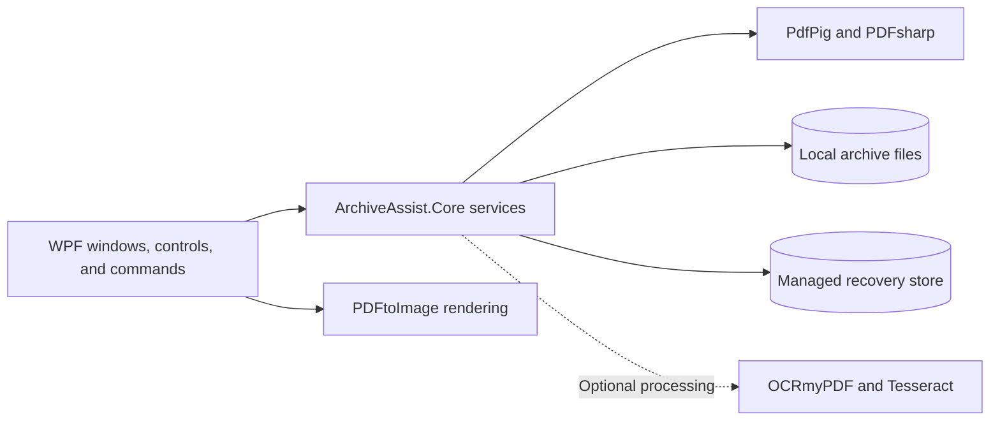

# Archive Assist

> A Windows desktop application for auditing, organizing, and safely editing large PDF archives.

Archive Assist turns folders full of PDFs and scanned images into a clear, actionable production
report. It combines recursive discovery, page counting, searchable-text QA, file-structure review,
PDF editing, and recovery-aware file operations in one focused WPF application.

This project began as a reimplementation of my Python PDF Workflow Assistant. Rebuilding it in C#
and WPF gave me the opportunity to design a more responsive desktop experience, separate reusable
PDF logic from the UI, and treat file safety as a first-class product requirement.

## At a glance

| Area | What Archive Assist provides |
| --- | --- |
| Discovery | Multi-file and multi-folder selection, drag and drop, recursive scanning, overlap deduplication, and recent locations |
| Production counts | Documents, maps, photos, photo backs, total production items, and configurable large-page rules |
| PDF quality assurance | Fast, sampled, or page-by-page searchable-text inspection with clear warnings and exact affected pages |
| Reporting | Searchable and sortable results, quick filters, summary metrics, Excel-friendly row copying, and file metadata |
| File structure | Hierarchical archive review, folder rollups, aligned count columns, and in-app file or folder renaming |
| PDF editing | Thumbnail and detailed page views, rotation, cropping, deletion, reordering, undo/redo, zooming, and panning |
| File safety | Verified writes, managed recovery points, configurable retention, and a Recovery Center |
| Page equalization | Previewed folder-by-folder PDF rebuilding with separate output and a page-level CSV audit trail |

## Why I built it

Archive production work often requires moving between a file browser, PDF viewer, spreadsheet, and
several one-purpose utilities. That makes routine review slower and increases the chance of losing
context—or changing the wrong file.

Archive Assist brings the common workflow into one application:

**Select → Configure → Scan → Review → Act**

1. Select any combination of files and folders.
2. Choose an appropriate QA depth and production rules.
3. Scan in the background while progress and elapsed time remain visible.
4. Review totals, warnings, report rows, and the original folder hierarchy.
5. Open, rename, edit, equalize, or recover files without leaving the workflow.

The application automatically moves from Discovery to Report after a scan and returns to Discovery
when the selection changes, preventing stale results from being mistaken for the current selection.

## Engineering highlights

### Recovery-aware file operations

File safety is built into the workflow rather than added as an afterthought:

- Scanning is read-only.
- Editor saves update the selected PDF in place only after retaining its original in managed
  application storage.
- In-place processing writes to a unique temporary file, verifies the result, retains a recovery
  point, and only then replaces the original.
- Restoring an earlier version first retains the current version, making the restore reversible.
- Page equalization writes to a separate output tree because it can combine and split many sources.
- Partial output is removed after cancellation or failure.

The Recovery Center lets users inspect, restore, open, or remove retained versions without filling
working folders with visible backup copies.

### Responsive work on large documents

Long scans and large PDFs are handled with bounded work and explicit cancellation:

- Discovery and QA run asynchronously with phased progress and retained partial results.
- The editor uses a virtualizing thumbnail panel instead of creating every page card at once.
- Page images are rendered near the viewport and kept in a bounded cache.
- Undo history is limited by both entry count and memory use.
- Inaccessible files are reported without stopping the rest of a scan.

### Testable separation of concerns

The solution separates the WPF application from reusable scanning and PDF services:



Core behavior is tested independently from the desktop UI. The xUnit suite covers discovery,
classification, page-size rules, searchable-text inspection, equalization, recovery, settings,
recent locations, renaming, rendering, view-model behavior, and WPF construction smoke tests.

The latest full verification completed with **63 passing tests**.

## Key workflows

### Scan and review an archive

Archive Assist accepts individual files, folders, or a mixture of both. Folders are searched
recursively, and overlapping selections are counted only once.

Three QA modes balance speed and depth:

| Mode | Behavior |
| --- | --- |
| Fast Count Only | Counts production without inspecting searchable text |
| Standard QA | Samples representative pages and reports whether a PDF is likely searchable |
| Deep OCR Check | Inspects every page and records the exact pages without extractable text |

The Report can be searched, sorted, or filtered to warnings, non-searchable PDFs, large scans, and
PDF errors. Selected or visible rows copy as tab-delimited values for direct pasting into Excel.
The Summary view provides production totals and opens the matching report rows when an actionable
metric is selected.

### Inspect and organize file structure

The File Structure view preserves folder hierarchy while rolling document, map, photo, and warning
counts up through parent folders. Fixed guides keep nested values aligned with their headers.

Files and folders can be renamed with `F2` or a context menu. Validation blocks invalid Windows
names and collisions, and Archive Assist returns to Discovery afterward so outdated scan results
are never left on screen.

### Edit a PDF

PDFs can be opened from the File menu, Report, or File Structure:

1. Select one or more pages in the virtualized thumbnail grid.
2. Rotate, crop, delete, or drag pages to reorder them.
3. Switch to Page View for close inspection, fit modes, zooming, and click-drag panning.
4. Undo or redo changes, then save with `Ctrl+S`.
5. Restore the original editing-session recovery point if needed.
6. Close and rescan to refresh the production report.

### Equalize PDF page counts

The Page Equalizer previews a folder-by-folder plan before writing. It rebuilds only folders that
need equalization, preserves alphabetical page order and relative subfolders, enforces the configured
page limit, and leaves every source PDF untouched.

Each run creates `equalization_manifest.csv`, providing a page-to-source audit trail for the output.

## Technology

- C# with nullable reference types
- .NET 10
- WPF and XAML
- PdfPig for PDF inspection and text extraction
- PDFsharp for PDF manipulation
- PDFtoImage for page rendering
- xUnit and coverlet for automated testing
- Optional OCRmyPDF and Tesseract integration

## Repository structure

```text
ArchiveAssist.slnx
├── src
│   ├── ArchiveAssist.App       WPF UI, commands, view models, rendering, and settings
│   └── ArchiveAssist.Core      Discovery, QA, recovery, editing, and equalization services
└── tests
    ├── ArchiveAssist.App.Tests UI-adjacent behavior and WPF smoke tests
    └── ArchiveAssist.Core.Tests
                                Core workflow and PDF service tests
```

## Getting started

### Requirements

- Windows 10 or Windows 11
- [.NET 10 SDK](https://dotnet.microsoft.com/download/dotnet/10.0)

Clone and run the application:

```powershell
git clone https://github.com/Lozo214/ArchiveAssist.git
cd ArchiveAssist
dotnet restore
dotnet run --project src/ArchiveAssist.App -c Release
```

Run the complete test suite:

```powershell
dotnet test ArchiveAssist.slnx -c Release
```

## Keyboard shortcuts

| Shortcut | Action |
| --- | --- |
| `F5` | Start a scan |
| `Ctrl+F` | Search the Report |
| `Ctrl+C` | Copy selected Report rows |
| `Ctrl+1` / `Ctrl+2` / `Ctrl+3` | Open Discovery, Report, or File Structure |
| `F2` | Rename the selected file or folder |
| `Ctrl+S` | Save in the PDF editor |
| `Ctrl+Z` / `Ctrl+Y` | Undo or redo a PDF edit |

## Experimental PDF processing

OCR and optimization are available under **Options → Experimental PDF Processing**, but they are
not part of the recommended production workflow. OCR development is currently paused while
performance and recognition quality are evaluated.

These optional features require OCRmyPDF 17 or later and a 64-bit Tesseract installation with
English language data. The core scanning, reporting, editing, recovery, and equalization workflows
do not require OCR tooling.

## Project status

Archive Assist is under active development. Its primary archive scanning, reporting, file-structure,
PDF editing, recovery, and page-equalization workflows are implemented and covered by automated
tests.

Current priorities include additional usability refinement, broader real-world archive testing, and
future investigation into faster and more accurate OCR options.
